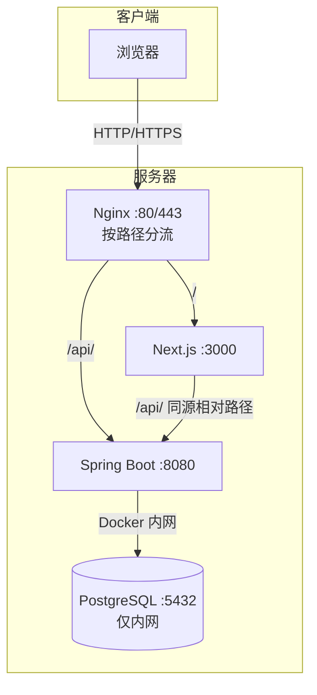

# 乌托邦开发者社区（Utopia）

> 前后端分离的开发者论坛：注册登录、话题发布、评论互动、点赞、搜索、分页。
>
> 在线演示：<http://39.105.43.180>（ICP 备案通过后迁移至正式域名）

---

## 功能特性

- 🔐 **认证体系**：注册 / 登录 / JWT 无状态认证（24h 过期），密码 BCrypt 加密
- 📝 **话题管理**：发布、删除（仅作者）、分类标签、关键词搜索
- 💬 **评论系统**：发表、删除（仅作者），列表展示
- ❤️ **点赞互动**：点赞 / 取消点赞，数据库级去重，批量状态查询
- 🔍 **搜索与分页**：关键词 + 分类筛选，防抖搜索，URL 同步状态
- 👤 **用户体系**：个人资料编辑、公开主页、当前用户信息
- 📱 **响应式 UI**：shadcn/ui 组件库，移动端适配（抽屉导航）

---

## 技术栈

| 层 | 技术 |
|---|---|
| 前端 | Next.js 16 · React 19 · Tailwind CSS v4 · shadcn/ui · date-fns |
| 后端 | Spring Boot 4.1 · Java 17 · Spring Security · JWT (jjwt) · JdbcTemplate |
| 存储 | PostgreSQL 16 · JUnit 5 / Mockito / MockMvc |
| 测试 | Vitest · Testing Library · Playwright (E2E) |
| 部署 | Docker · Docker Compose · Nginx 反向代理 · HTTPS |

> 前端目录 `day15/`，后端目录 `day23/`（学习项目按天归档的目录名）。

---

## 架构概览



**设计要点**：前端生产环境 API 地址留空走同源相对路径 `/api`（Nginx 统一转发，无跨域、无混合内容）；数据库端口只绑本机回环，公网不可达。

详见 [docs/architecture.md](docs/architecture.md)

---

## 快速开始

### 方式一：Docker 一键部署

```bash
# 1. 准备环境变量
cp .env.example .env

# 2. 构建后端镜像（compose 里 backend 没有 build 段，需先构建）
docker build -t utopia-backend:day53 day23

# 3. 启动全部服务（frontend 有 build 段，up -d 会自动构建）
docker compose up -d

# 4. 访问
#    前端 http://localhost:3000
#    后端 http://localhost:8080/api/topics
```

### 方式二：本地开发

```bash
# 后端（day23/）
mvn spring-boot:run        # 依赖本地 PostgreSQL，连接 localhost:5432/utopia

# 前端（day15/）
npm install
npm run dev                # http://localhost:3000
```

---

## 测试

| 类型 | 命令（目录） | 覆盖 |
|---|---|---|
| 前端单元测试 | `npm test`（day15/） | Vitest：时间格式化、API 封装、登录/注册/发布表单 |
| 后端测试 | `mvn test`（day23/） | JUnit5 + Mockito：Controller / Repository 集成 / 校验 |
| 端到端测试 | `npm run test:e2e`（day15/） | Playwright：注册登录、发帖、评论全流程 |

> 测试数据与线上隔离：后端测试连独立 `utopia_test` 库，E2E 走本地 3000 端口。

---

## 项目结构

```text
├── day15/          # 前端 Next.js 16
│   ├── app/        #   App Router 页面（9 个路由）
│   ├── components/ #   组件（navbar / footer / ui）
│   ├── lib/        #   api.js（fetch 封装）/ time.js / utils.js
│   └── e2e/        #   Playwright 测试
├── day23/          # 后端 Spring Boot 4.1
│   ├── src/main/java/com/utopia/day23/
│   │   ├── *Controller.java   # REST 控制器（根包下）
│   │   ├── service/     # 业务逻辑
│   │   ├── repository/  # JdbcTemplate 数据访问
│   │   ├── model/       # 实体
│   │   ├── dto/         # 请求/响应 DTO
│   │   ├── exception/   # 自定义异常
│   │   ├── config/      # SecurityConfig / WebConfig
│   │   ├── security/    # JwtAuthenticationFilter
│   │   └── util/        # JwtUtil
│   ├── src/main/resources/  # 配置文件
│   └── db/           # init.sql 建表 / 迁移脚本
├── docker-compose.yml # 三服务编排
└── docs/             # 架构 / 数据库 / API 文档
```

---

## 文档

- [系统架构详解](docs/architecture.md) —— 架构图、JWT 流程、部署拓扑、Nginx 反代
- [数据库设计](docs/database.md) —— ER 图、4 张表结构、设计决策（点赞去重/时间戳）
- [REST API 文档](docs/api.md) —— 16 个端点、认证方式、统一错误结构

---

## 部署环境

- **服务器**：阿里云轻量应用服务器，Ubuntu 22.04，2核 2G
- **反向代理**：Nginx（`/` → 前端 3000，`/api/` → 后端 8080）
- **HTTPS**：443 已配置（当前为自签证书，ICP 备案通过后替换为 Let's Encrypt 正式证书）
- **容器化**：Docker + Docker Compose，镜像 tag `day53` 标识部署基线

---

## 环境变量

所有环境变量见 [.env.example](.env.example)（模板，不含真实密钥）：

| 变量 | 说明 |
|---|---|
| `POSTGRES_DB / USER / PASSWORD` | PostgreSQL 初始化 |
| `DB_URL / DB_USERNAME / DB_PASSWORD` | 后端数据库连接（生产用 Docker 内网 `postgres` 主机名） |
| `JWT_SECRET` | JWT 签名密钥（生产必须改强随机值） |
| `CORS_ALLOWED_ORIGINS` | 允许的前端来源 |
| `JWT_EXPIRATION` | Token 有效期（毫秒，默认 24h） |
| `NEXT_PUBLIC_API_URL` | 前端 API 地址（生产留空 = 相对路径） |

---

> 💬 **面试要点**：`NEXT_PUBLIC_` 前缀变量在 `npm run build` 时内联进 JS（构建期烧死），所以部署时的构建参数决定实际请求地址——"谁构建听谁的"。生产留空走同源相对路径，一次解决跨域/混合内容/证书问题。
