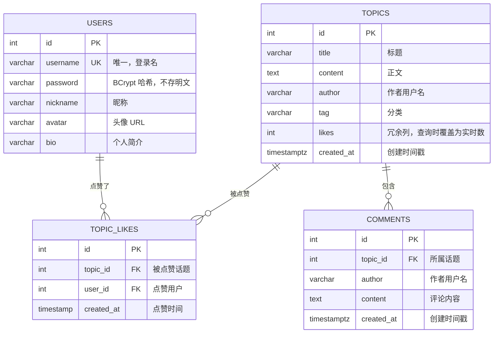

# 数据库设计：乌托邦开发者社区

> PostgreSQL 16，表结构定义在 `day23/db/init.sql`
>
> 4 张表：`users` / `topics` / `comments` / `topic_likes`

---

## 一、ER 图



---

## 二、表结构详解

### 2.1 users（用户表）

| 字段 | 类型 | 约束 | 说明 |
|---|---|---|---|
| id | SERIAL | PK | 自增主键 |
| username | VARCHAR(50) | NOT NULL, UNIQUE | 登录名，唯一 |
| password | VARCHAR(255) | NOT NULL | BCrypt 哈希（不存明文） |
| nickname | VARCHAR(50) | - | 昵称 |
| avatar | VARCHAR(500) | - | 头像 URL |
| bio | VARCHAR(500) | - | 个人简介 |

### 2.2 topics（话题表）

| 字段 | 类型 | 约束 | 说明 |
|---|---|---|---|
| id | SERIAL | PK | 自增主键 |
| title | VARCHAR(200) | NOT NULL | 标题 |
| content | TEXT | NOT NULL | 正文 |
| author | VARCHAR(50) | NOT NULL | 作者用户名 |
| tag | VARCHAR(20) | - | 分类（前端/后端/AI/数据库…） |
| likes | INTEGER | DEFAULT 0 | 冗余计数列（实际查询被覆盖，见 3.3） |
| created_at | TIMESTAMPTZ | NOT NULL, DEFAULT CURRENT_TIMESTAMP | 创建时间戳 |

### 2.3 comments（评论表）

| 字段 | 类型 | 约束 | 说明 |
|---|---|---|---|
| id | SERIAL | PK | 自增主键 |
| topic_id | INTEGER | NOT NULL, FK → topics.id, ON DELETE CASCADE | 所属话题 |
| author | VARCHAR(50) | NOT NULL | 作者用户名 |
| content | TEXT | NOT NULL | 评论内容 |
| created_at | TIMESTAMPTZ | NOT NULL, DEFAULT CURRENT_TIMESTAMP | 创建时间戳 |

### 2.4 topic_likes（点赞关系表）

| 字段 | 类型 | 约束 | 说明 |
|---|---|---|---|
| id | SERIAL | PK | 自增主键 |
| topic_id | INTEGER | NOT NULL, FK → topics.id, ON DELETE CASCADE | 被点赞话题 |
| user_id | INTEGER | NOT NULL, FK → users.id, ON DELETE CASCADE | 点赞用户 |
| created_at | TIMESTAMP | NOT NULL, DEFAULT CURRENT_TIMESTAMP | 点赞时间 |

---

## 三、设计决策

### 3.1 点赞为什么用单独的关系表，而不是 `topics.likes` 计数？

最初的 `topics` 表有 `likes INTEGER DEFAULT 0` 计数列，但它有三个致命问题：

1. **无法取消点赞**：只知道"总点赞数"，不知道"哪些用户点过赞"。
2. **无法去重**：同一个用户点两次会累加，需要前端防抖 + 后端判断，很脆弱。
3. **无法展示"我点过赞吗"**：话题列表要显示高亮，必须查每个用户的点赞状态。

`topic_likes` 表用 **(topic_id, user_id) 联合唯一约束**，数据库层面保证"一个用户对同一个话题只能点赞一次"——这是**数据库兜底去重**，比应用层判断可靠得多。点赞状态、是否已赞、取消点赞全部基于这张关系表查询：

```sql
-- 一个用户对同一话题只能有一条记录（联合唯一约束兜底）
ALTER TABLE topic_likes
    ADD CONSTRAINT uk_topic_likes_topic_user UNIQUE (topic_id, user_id);
```

> 💬 **面试要点**：这是一对多"间接"的典型——`users` 和 `topics` 之间是多对多关系，拆成关系表后各与 `topic_likes` 形成一对多。多对多建模、联合唯一约束、外键级联删除（话题删了，它的点赞记录跟着删）都是高频考点。

### 3.2 时间戳为什么用 TIMESTAMPTZ？

`TIMESTAMPTZ`（TIMESTAMP WITH TIME ZONE）存的是**绝对时刻**，PostgreSQL 内部按 UTC 存储，显示时按客户端时区换算。这样：

- 北京用户和国外用户看到各自时区的"正确时间"。
- Java 侧用 `OffsetDateTime` 读取（`rs.getObject("created_at", OffsetDateTime.class)`），Jackson 自动序列化为带时区的 ISO-8601 字符串。
- 前端用 date-fns `formatDistanceToNow` 显示"3 分钟前"这类相对时间。

对比旧设计的 `VARCHAR(50)` 存 `"刚刚"`：那是把"表达"存进了数据库，永远无法知道真实时间。

> 💬 **面试要点**：**存事实不存表达**——数据库存时间戳（事实），显示格式（相对时间）由前端格式化。如果存"刚刚"，10 分钟后还是"刚刚"，数据就烂了。

### 3.3 `topics.likes` 冗余列与 `replies` 计算列

- `topics.likes`：表里**有**这个列，但所有查询语句实际用子查询覆盖为 `topic_likes` 表的实时 `COUNT(*)`，即该列已不被读取。
- `replies`（评论数）：**不是表列**，是查询时 `COUNT(*) FROM comments` 动态计算的。

两者都是"查询时计算真实值"，保证数字准确。`topics.likes` 是历史遗留冗余列，保留但不用——面试时讲清"冗余列 vs 实时计算"的取舍即可。

### 3.4 为什么 `author` 存用户名而不是 user_id？

`topics.author` / `comments.author` 存的是用户名（VARCHAR），不是外键。这是**反规范化**取舍：

- 优点：查询话题列表不用 JOIN users 表就能直接显示作者名，接口响应简单。
- 缺点：用户名变更时历史记录不跟随（本项目 username 设计为不可改，所以没有这个问题）。

> 💬 **面试要点**：规范设计应该存 `user_id` 外键 + JOIN 取名字。这里为了接口简洁选用户名，是"够用优先"的取舍。可以主动说明这个 trade-off 以展示思考深度。

---

## 四、约束与索引

| 类型 | 对象 | 说明 |
|---|---|---|
| 主键 | 4 张表 `id` | SERIAL 自增 |
| 唯一约束 | `users.username` | 登录名唯一 |
| 唯一约束 | `topic_likes (topic_id, user_id)` | 一个用户对一话题只赞一次 |
| 外键 | `comments.topic_id → topics.id` | ON DELETE CASCADE |
| 外键 | `topic_likes.topic_id → topics.id` | ON DELETE CASCADE |
| 外键 | `topic_likes.user_id → users.id` | ON DELETE CASCADE |
| 非空默认 | `created_at` | `TIMESTAMPTZ NOT NULL DEFAULT CURRENT_TIMESTAMP` |

级联删除的语义：**删话题 → 它的评论、点赞记录一并删除**，不会产生孤儿数据。这也是为什么删除话题时后端不需要手动删关联评论——数据库帮你做了。

---

## 五、建表 SQL（完整）

```sql
CREATE TABLE IF NOT EXISTS users (
    id SERIAL PRIMARY KEY,
    username VARCHAR(50) NOT NULL UNIQUE,
    password VARCHAR(255) NOT NULL,
    nickname VARCHAR(50),
    avatar VARCHAR(500),
    bio VARCHAR(500)
);

CREATE TABLE IF NOT EXISTS topics (
    id SERIAL PRIMARY KEY,
    title VARCHAR(200) NOT NULL,
    content TEXT NOT NULL,
    author VARCHAR(50) NOT NULL,
    tag VARCHAR(20),
    likes INTEGER DEFAULT 0,
    created_at TIMESTAMPTZ NOT NULL DEFAULT CURRENT_TIMESTAMP
);

CREATE TABLE IF NOT EXISTS comments (
    id SERIAL PRIMARY KEY,
    topic_id INTEGER NOT NULL,
    author VARCHAR(50) NOT NULL,
    content TEXT NOT NULL,
    created_at TIMESTAMPTZ NOT NULL DEFAULT CURRENT_TIMESTAMP,
    CONSTRAINT fk_comments_topic
        FOREIGN KEY (topic_id)
        REFERENCES topics(id)
        ON DELETE CASCADE
);

CREATE TABLE IF NOT EXISTS topic_likes (
    id SERIAL PRIMARY KEY,
    topic_id INTEGER NOT NULL,
    user_id INTEGER NOT NULL,
    created_at TIMESTAMP NOT NULL DEFAULT CURRENT_TIMESTAMP,
    CONSTRAINT uk_topic_likes_topic_user
        UNIQUE (topic_id, user_id),
    CONSTRAINT fk_topic_likes_topic
        FOREIGN KEY (topic_id)
        REFERENCES topics(id)
        ON DELETE CASCADE,
    CONSTRAINT fk_topic_likes_user
        FOREIGN KEY (user_id)
        REFERENCES users(id)
        ON DELETE CASCADE
);
```

> 迁移脚本：老库升级到 `created_at` 见 `day23/db/migrate-2026-08-16_add_created_at.sql`（幂等 SQL，可重复执行）。
