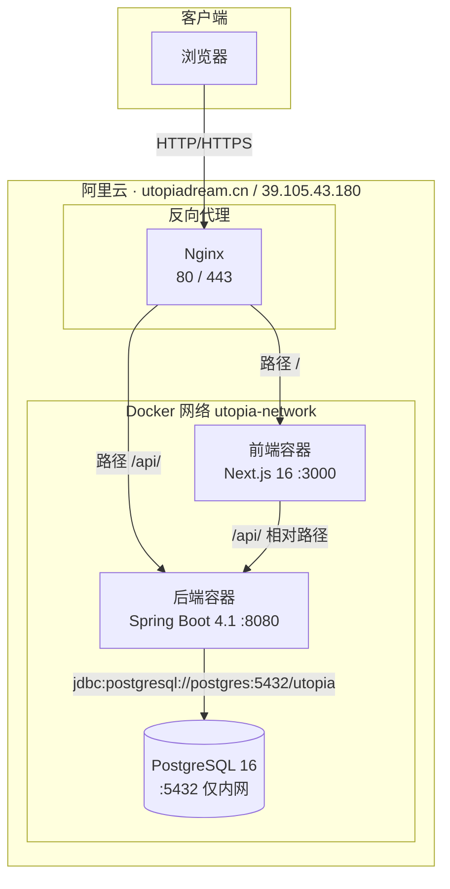
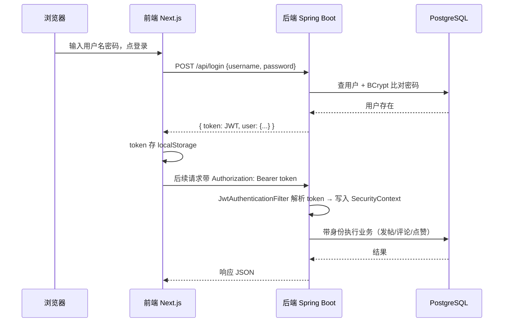

# 系统架构：乌托邦开发者社区

> 前后端分离 + Docker 容器化 + Nginx 反向代理，部署在阿里云 Ubuntu 22.04

---

## 一、整体架构图



### 各层职责

| 层 | 技术 | 职责 |
|---|---|---|
| 客户端 | 浏览器 | 渲染页面，调 `/api/` 相对路径接口 |
| 反向代理 | Nginx | 单入口，按路径分流：`/` → 前端，`/api/` → 后端 |
| 前端容器 | Next.js 16 + React 19 | SSR/CSR 页面、UI、前端交互 |
| 后端容器 | Spring Boot 4.1 + JWT | REST API、认证鉴权、业务逻辑、数据访问 |
| 数据库 | PostgreSQL 16 | 持久化存储 |

### 关键设计点

1. **同源相对路径**：前端调 `/api/`（不带域名），由 Nginx 统一转发到后端。生产环境 `NEXT_PUBLIC_API_URL` 留空（`api.js` 用 `??` 允许空字符串），浏览器与 API 同源，**不产生跨域、不产生混合内容**。
2. **数据库不暴露公网**：PostgreSQL 端口只绑本机回环 `127.0.0.1:5432`，公网不可达；后端通过 Docker 内网主机名 `postgres` 连接，不依赖端口映射。
3. **单入口统一管理**：Nginx 同时管 80（HTTP）和 443（HTTPS，自签证书，备案后换 Let's Encrypt 真证书）。

---

## 二、JWT 认证流程



### JWT 生命周期

| 阶段 | 说明 |
|---|---|
| 登录 | 后端校验密码（BCrypt `matches`），生成 JWT（HS256，subject=用户名，24h 过期） |
| 存储 | 前端存 `localStorage`（key `token` / `user`） |
| 携带 | `lib/api.js` 的 `request()` 自动从 localStorage 取 token，加 `Authorization: Bearer` 头 |
| 校验 | `JwtAuthenticationFilter` 在 Spring Security 过滤器链中解析 token，成功则写入 `SecurityContext` |
| 身份 | Controller 里 `authentication.getName()` 拿到用户名，作为 author / 权限判断依据 |

> 💬 **面试要点**：**JWT 无状态**——服务端不存 session，token 里自带身份信息，天然适合多实例横向扩展。代价是"无法主动吊销"，本项目用 24h 有效期兜底。对比传统 session 方案（服务端存会话，可吊销，但需要 session 共享或粘性会话），是常见面试对比题。

---

## 三、请求链路示例

### 3.1 登录

浏览器 → 前端表单 → `POST /api/login` → Nginx 识别 `/api/` 转发到后端 → 后端 BCrypt 校验 → 生成 JWT 返回 → 前端存 localStorage → 刷新页面后从 localStorage 恢复登录态。

### 3.2 发布话题

浏览器 → 发布表单 → `POST /api/topics` → `request()` 自动带 Bearer token → Nginx 转发 → JwtAuthenticationFilter 校验 → Controller 从 `authentication.getName()` 取 username 作 author → 写入 topics 表 → 返回新话题 → 前端跳转讨论区。

### 3.3 点赞

浏览器 → 点 ❤️ → `POST /api/topics/{id}/like` → 带 token → 后端 `TopicLikeService.toggleLike`（事务）→ 已有记录则删除（取消赞），否则插入 → 返回 `{liked, likes}` → 前端更新按钮状态。

---

## 四、部署拓扑（Docker Compose）

`docker-compose.yml` 定义三个服务，共享 `utopia-network`：

```yaml
services:
  postgres:
    image: postgres:16
    ports:
      - "127.0.0.1:5432:5432"   # 只绑本机回环，公网不可达
    volumes:
      - postgres-data:/var/lib/postgresql/data
      - ./day23/db/init.sql:/docker-entrypoint-initdb.d/01-init.sql:ro
    healthcheck:
      test: ["CMD-SHELL", "pg_isready -U ${POSTGRES_USER} -d ${POSTGRES_DB}"]

  backend:
    image: utopia-backend:day53    # 本地构建后 scp/load 到服务器
    depends_on:
      postgres:
        condition: service_healthy  # 等数据库健康后再启动
    ports:
      - "8080:8080"

  frontend:
    build:
      context: ./day15
      args:
        NEXT_PUBLIC_API_URL: ${NEXT_PUBLIC_API_URL}  # 生产留空 = 相对路径
    image: utopia-frontend:day53
    ports:
      - "3000:3000"
    depends_on:
      - backend
```

### 设计要点

- **镜像 tag 约定**：`day53` 表示第 53 天起的部署基线，改代码后 tag 递增，保证服务器镜像版本可追溯。
- **健康检查**：backend 依赖 postgres 的 `service_healthy`，避免数据库没起来后端就崩溃。
- **命名卷**：`postgres-data` 持久化数据库，容器重建数据不丢。
- **构建策略**：backend 镜像本地构建后 `docker save` → `scp` → 服务器 `docker load`；frontend 因 `NEXT_PUBLIC_` 构建期烧死，在服务器用 compose 的 build 段按需构建（`谁构建听谁的`）。

### 生产部署流程

```text
本地：docker build -t utopia-backend:day53 day23
     docker build --build-arg NEXT_PUBLIC_API_URL= -t utopia-frontend:day53 day15
     docker save ... → scp 到服务器 → docker load
服务器：跑迁移 SQL（如 created_at 改造）
     docker compose up -d
     nginx -s reload（改配置后）
```

> 💬 **面试要点**：`NEXT_PUBLIC_` 前缀变量在 `npm run build` 时**内联进 JS**，是构建期烧死的。本地构建会烧本地地址，所以部署必须用正确的构建参数（生产留空走相对路径）。口诀"谁构建听谁的"。

---

## 五、Nginx 反向代理

生产单入口配置（80 端口版，443 版加证书）：

```nginx
server {
    listen 80 default_server;
    listen [::]:80 default_server;

    location / {
        proxy_pass http://127.0.0.1:3000;       # 前端兜底
    }

    location /api/ {
        proxy_pass http://127.0.0.1:8080;       # 后端 API，别带结尾 /
    }
}
```

- `/api/` 的 `proxy_pass` **不带结尾斜杠**，这样 `/api/topics` 原样透传给后端，不会剥掉 `/api/` 前缀导致 404。
- 同源相对路径方案下，Nginx 同时解决三个问题：**跨域（CORS）、混合内容（HTTP 页面调 HTTPS 接口）、证书错误**。

> 💬 **面试要点**：反向代理的价值——统一入口、隐藏内部服务、按路径分流、后续可加缓存/限流/负载均衡。CORS 的另一种解法是后端 `CORS_ALLOWED_ORIGINS` 白名单（本项目也配了），但同源后基本用不上。

---

## 六、安全设计概览

| 层 | 措施 |
|---|---|
| 认证 | JWT（HS256），24h 过期，`Authorization: Bearer` 头传递 |
| 密码 | BCrypt 哈希存储，绝不存明文 |
| 授权 | 服务端校验资源所有权（删除话题/评论必须作者本人） |
| 身份 | author 从 JWT 取，不信任请求体 |
| 参数 | `@Valid` Bean Validation 校验（非空/长度/格式） |
| 数据库 | 端口只绑回环、Docker 内网访问、唯一约束去重 |
| 传输 | Nginx 支持 HTTPS（当前自签，备案后 Let's Encrypt 真证书） |
